# 🖥️ Portfolio Website - ASP.NET

**Personal portfolio website** built with **ASP.NET Web Application**, showcasing web development skills. Made with dedication

[](https://docs.microsoft.com/en-us/dotnet/csharp/) 
[](https://dotnet.microsoft.com/apps/aspnet)
[](https://www.microsoft.com/en-us/sql-server)
[](https://developer.mozilla.org/en-US/docs/Web/HTML)
[](https://developer.mozilla.org/en-US/docs/Web/CSS)
[](https://developer.mozilla.org/en-US/docs/Web/JavaScript)

---

## 🌟 Features

- **Admin login**: Secure authentication for administrators.  
- **Multiple pages**: Home, Projects, About, and more.  
- **Database integration**: Fully connected to **MS SQL Server**.  
- **CRUD operations**: Create, Read, Update, Delete content easily.  
- **Session & cookies management**: Securely manages user sessions.  
- **Technologies used**: C#, ASP.NET, HTML, CSS, JavaScript.

---
---

## 📸 Project Screenshots

### About Me Page (Introduction)  
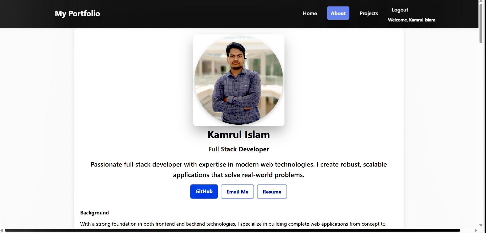

### Technical Skills Overview  
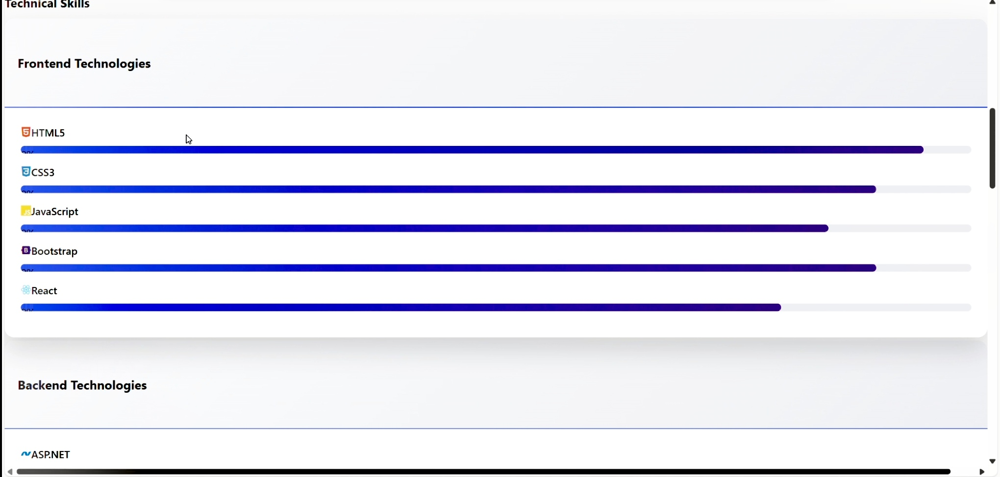

### Page Footer Section  
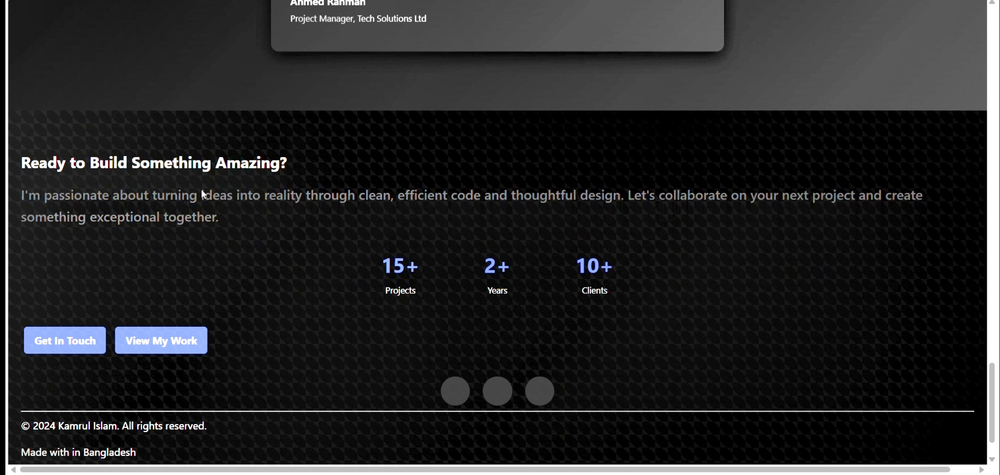

### Featured Project (Currently Running)  
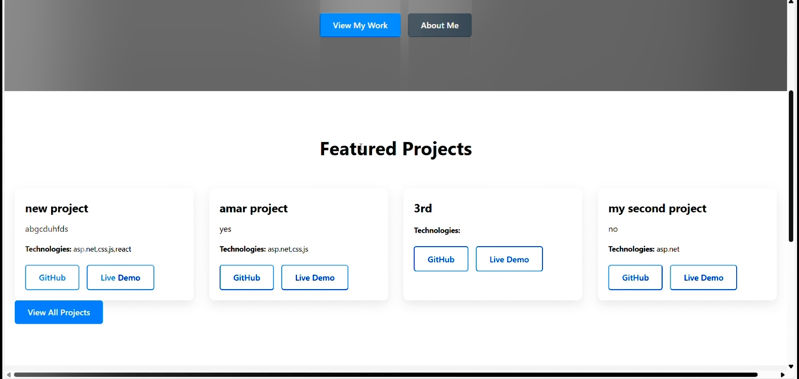

### Project Management Dashboard  
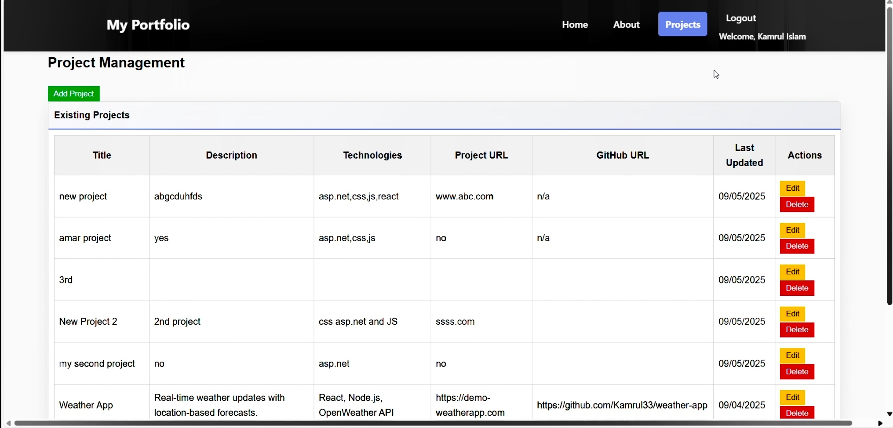

### Add New Project Form  


### Newly Added Project Display  
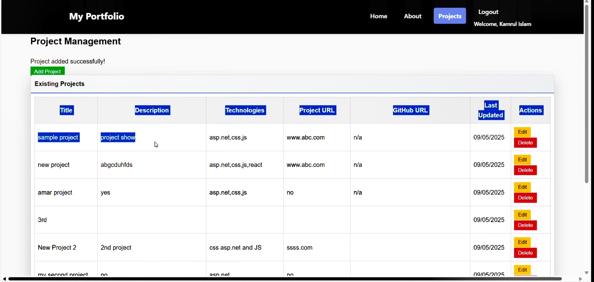

### Database Confirmation – Project Added Successfully  
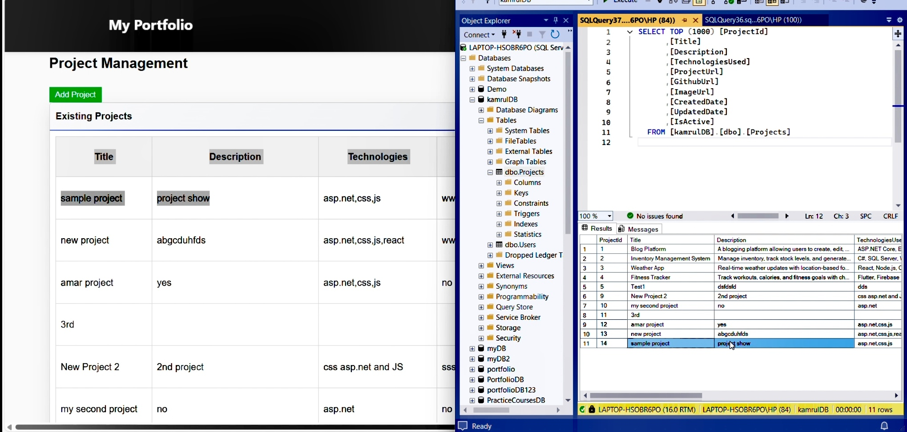

### Edit Project Form  
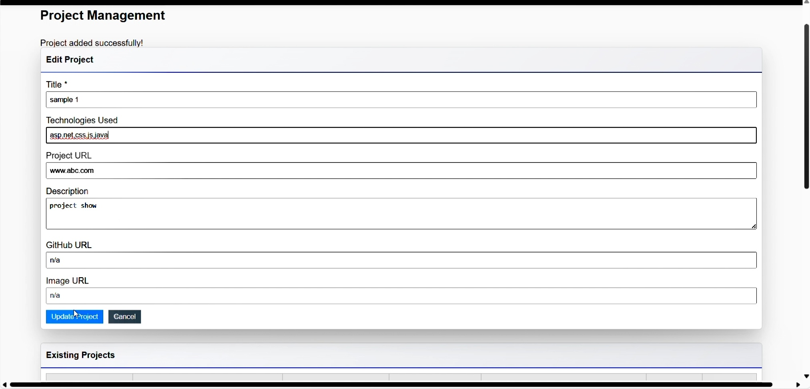

### Project Editing (Detailed View)  
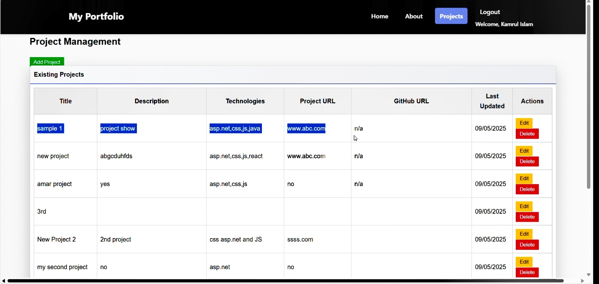

### Database Confirmation – Project Updated Successfully  
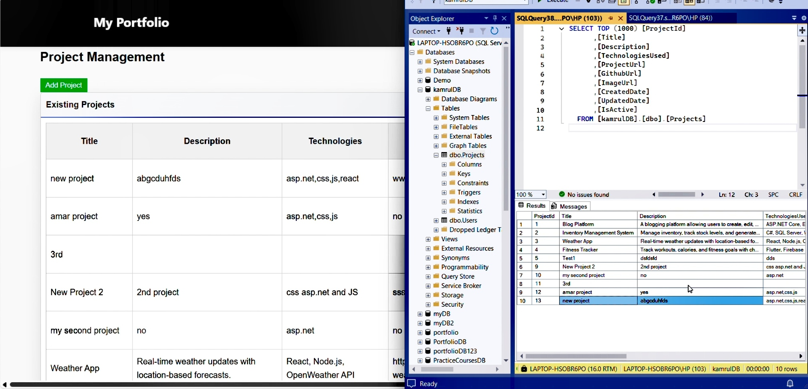
### Delete Project Form  
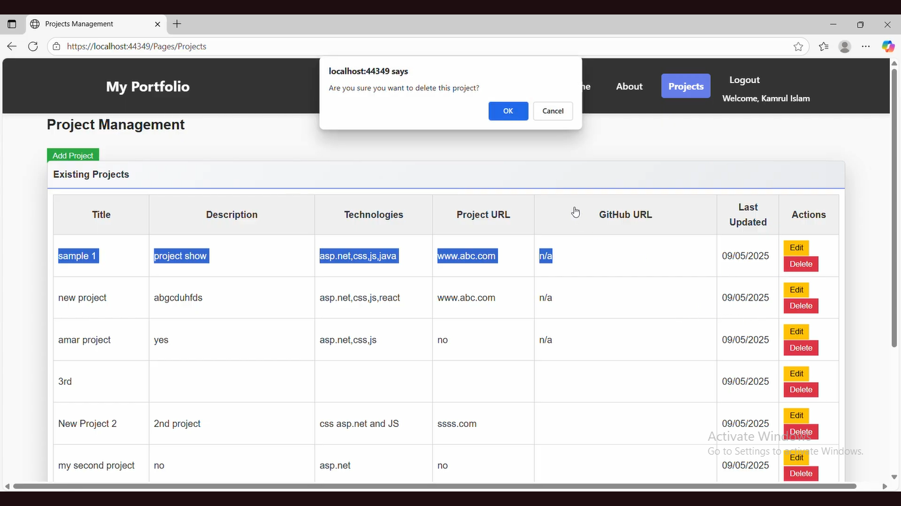

### Deleted Project from UI  
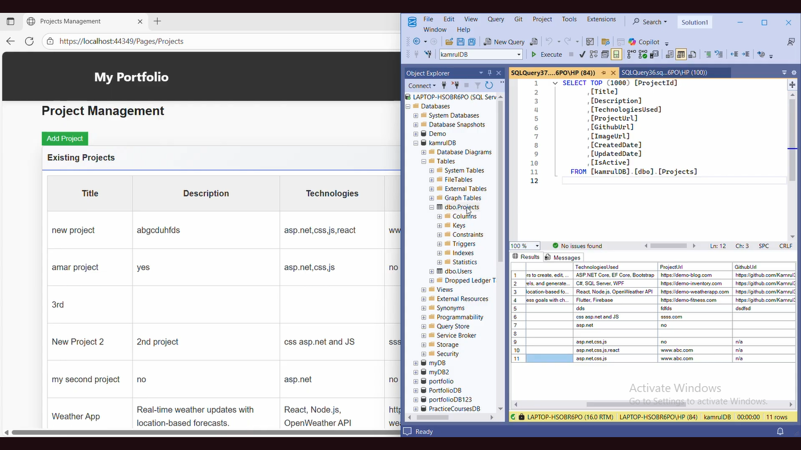

### Deleted Project from Database  
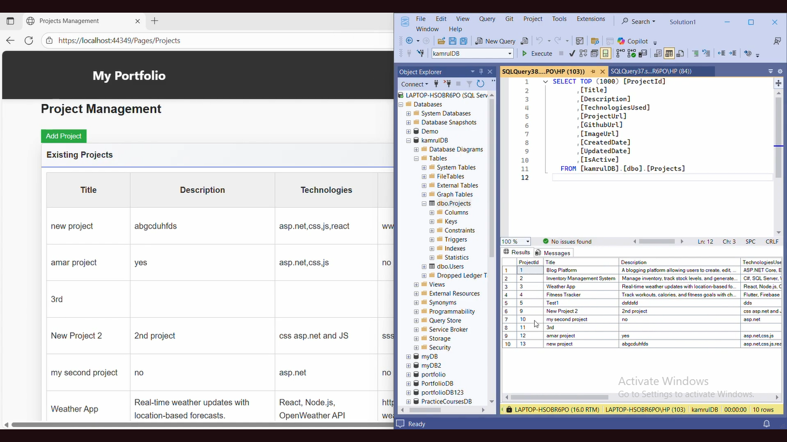


### Code Structure Overview  
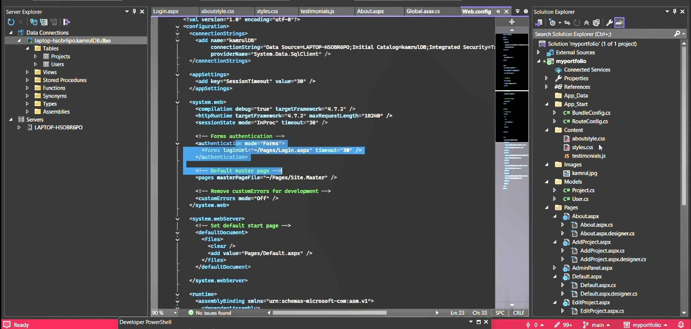

## 🚀 Getting Started

1. Clone the repository:
   ```bash
   git clone https://github.com/username/portfolio-website-aspnet.git
