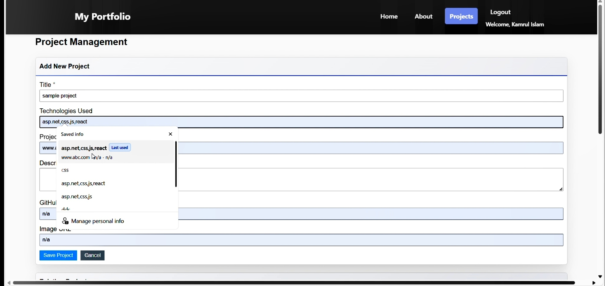

# 🖥️ Portfolio Website - ASP.NET

**Personal portfolio website** built with **ASP.NET Web Application**, showcasing web development skills. Made with dedication

[](https://docs.microsoft.com/en-us/dotnet/csharp/) 
[](https://dotnet.microsoft.com/apps/aspnet)
[](https://www.microsoft.com/en-us/sql-server)
[](https://developer.mozilla.org/en-US/docs/Web/HTML)
[](https://developer.mozilla.org/en-US/docs/Web/CSS)
[](https://developer.mozilla.org/en-US/docs/Web/JavaScript)

---

## 🌟 Features

- **Admin login**: Secure authentication for administrators.  
- **Multiple pages**: Home, Projects, About, and more.  
- **Database integration**: Fully connected to **MS SQL Server**.  
- **CRUD operations**: Create, Read, Update, Delete content easily.  
- **Session & cookies management**: Securely manages user sessions.  
- **Technologies used**: C#, ASP.NET, HTML, CSS, JavaScript.

---
---

## 📸 Project Screenshots

### Description for p-1.jpg


### Description for p-2.jpg


### Description for p-5.jpg


### Description for p-6.jpg


### Description for p-7.jpg


### Description for p-8.jpg


### Description for p-9.jpg


### Description for p-10.jpg


### Description for p-11.jpg


### Description for p-12.jpg


### Description for p-13.jpg


### Description for p-14.jpg


### Description for p-15.jpg


## 🚀 Getting Started

1. Clone the repository:
   ```bash
   git clone https://github.com/username/portfolio-website-aspnet.git
